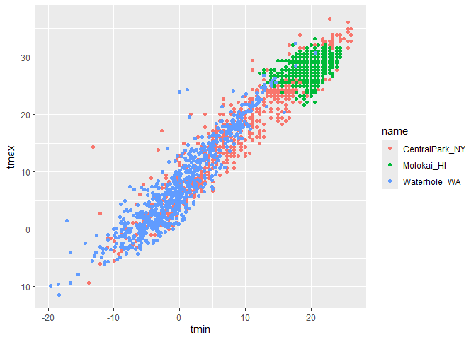
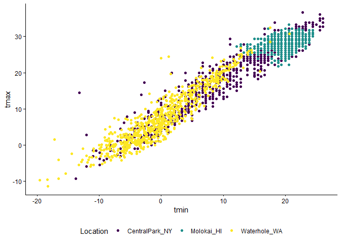
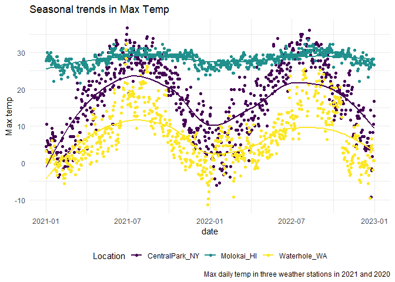
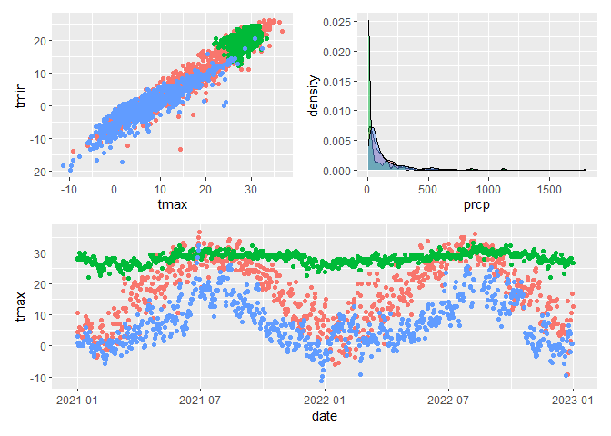

02_viz
================
Julian Morales
2026-10-06

``` r
library(tidyverse)
```

    ## Warning: package 'tidyverse' was built under R version 4.6.1

    ## ── Attaching core tidyverse packages ──────────────────────── tidyverse 2.0.0 ──
    ## ✔ dplyr     1.2.1     ✔ readr     2.2.0
    ## ✔ forcats   1.0.1     ✔ stringr   1.6.0
    ## ✔ ggplot2   4.0.3     ✔ tibble    3.3.1
    ## ✔ lubridate 1.9.5     ✔ tidyr     1.3.2
    ## ✔ purrr     1.2.2     
    ## ── Conflicts ────────────────────────────────────────── tidyverse_conflicts() ──
    ## ✖ dplyr::filter() masks stats::filter()
    ## ✖ dplyr::lag()    masks stats::lag()
    ## ℹ Use the conflicted package (<http://conflicted.r-lib.org/>) to force all conflicts to become errors

``` r
library(ggridges)
```

    ## Warning: package 'ggridges' was built under R version 4.6.1

``` r
library(p8105.datasets)
data("weather_df")
```

Colors!!!

``` r
weather_df |> 
  ggplot(aes(x=tmin, y=tmax, color = name))+
  geom_point()
```

    ## Warning: Removed 17 rows containing missing values or values outside the scale range
    ## (`geom_point()`).

<!-- -->

``` r
  scale_color_hue(h = c(100, 100))
```

    ## <ggproto object: Class ScaleDiscrete, Scale, gg>
    ##     aesthetics: colour
    ##     axis_order: function
    ##     break_info: function
    ##     break_positions: function
    ##     breaks: waiver
    ##     call: call
    ##     clone: function
    ##     dimension: function
    ##     drop: TRUE
    ##     expand: waiver
    ##     fallback_palette: function
    ##     get_breaks: function
    ##     get_breaks_minor: function
    ##     get_labels: function
    ##     get_limits: function
    ##     get_transformation: function
    ##     guide: legend
    ##     is_discrete: function
    ##     is_empty: function
    ##     labels: waiver
    ##     limits: NULL
    ##     make_sec_title: function
    ##     make_title: function
    ##     map: function
    ##     map_df: function
    ##     minor_breaks: waiver
    ##     n.breaks.cache: NULL
    ##     na.translate: TRUE
    ##     na.value: grey50
    ##     name: waiver
    ##     palette: function
    ##     palette.cache: NULL
    ##     position: left
    ##     range: environment
    ##     rescale: function
    ##     reset: function
    ##     train: function
    ##     train_df: function
    ##     transform: function
    ##     transform_df: function
    ##     super:  <ggproto object: Class ScaleDiscrete, Scale, gg>

``` r
weather_df |> 
  ggplot(aes(x=tmin, y=tmax, color = name))+
  geom_point()+
  viridis::scale_color_viridis(
    name = "Location",
    discrete = TRUE
  )+
  theme(legend.position = "bottom")
```

    ## Warning: Removed 17 rows containing missing values or values outside the scale range
    ## (`geom_point()`).

<!-- -->

``` r
weather_df |> 
  ggplot(aes(x=tmin, y=tmax, color = name))+
  geom_point()+
  viridis::scale_color_viridis(
    name = "Location",
    discrete = TRUE
  )+
  theme_classic()+
  theme(legend.position = "bottom")
```

    ## Warning: Removed 17 rows containing missing values or values outside the scale range
    ## (`geom_point()`).

<!-- -->

update tmax vs date plot

``` r
weather_df |> 
  ggplot(aes(x=date, y=tmax, color = name))+
  geom_point()+
  geom_smooth(se = FALSE)+
  labs(
    title = "Seasonal trends in Max Temp",
    x = "date",
    y = "Max temp",
    caption = "Max daily temp in three weather stations in 2021 and 2020",
    color = "Location"
  )+
  viridis::scale_color_viridis(
    discrete = TRUE
  )+
  theme_minimal()+
  theme(legend.position = "bottom")
```

    ## `geom_smooth()` using method = 'loess' and formula = 'y ~ x'

    ## Warning: Removed 17 rows containing non-finite outside the scale range
    ## (`stat_smooth()`).

    ## Warning: Removed 17 rows containing missing values or values outside the scale range
    ## (`geom_point()`).

<!-- -->

## Two More Weird Things

``` r
central_park_df = 
  weather_df |> 
  filter(name == "CentralPark_NY")

molokai_df = 
  weather_df |> 
  filter(name == "Molokai_HI")

ggplot(molokai_df, aes(x = date, y = tmax, color = name))+
  geom_point()+
  geom_line(data = central_park_df)
```

    ## Warning: Removed 1 row containing missing values or values outside the scale range
    ## (`geom_point()`).

<!-- -->

Multiple panels with different plot types stiched together by patchwork

``` r
ggp_tmax_tmin = 
  weather_df |> 
  ggplot(aes(x = tmax, y = tmin, color = name))+
  geom_point()

ggp_prcp_density = 
  weather_df |> 
  filter(prcp > 0) |> 
  ggplot(aes(x = prcp, fill = name))+
  geom_density(alpha = .5)

ggp_seasonal = 
  weather_df |> 
  ggplot(aes(x=date, y=tmax, color = name))+
  geom_point()
```

we now have everything we need!

``` r
library(patchwork)
```

    ## Warning: package 'patchwork' was built under R version 4.6.1

``` r
ggp_tmax_tmin = 
  weather_df |> 
  ggplot(aes(x = tmax, y = tmin, color = name))+
  geom_point()+
  theme(legend.position = "none")

ggp_prcp_density = 
  weather_df |> 
  filter(prcp > 0) |> 
  ggplot(aes(x = prcp, fill = name))+
  geom_density(alpha = .5)+
  theme(legend.position = "none")

ggp_seasonal = 
  weather_df |> 
  ggplot(aes(x=date, y=tmax, color = name))+
  geom_point()+
  theme(legend.position = "none")

(ggp_tmax_tmin - ggp_prcp_density)/ggp_seasonal
```

    ## Warning: Removed 17 rows containing missing values or values outside the scale range
    ## (`geom_point()`).

    ## Warning: Removed 17 rows containing missing values or values outside the scale range
    ## (`geom_point()`).

<!-- -->
